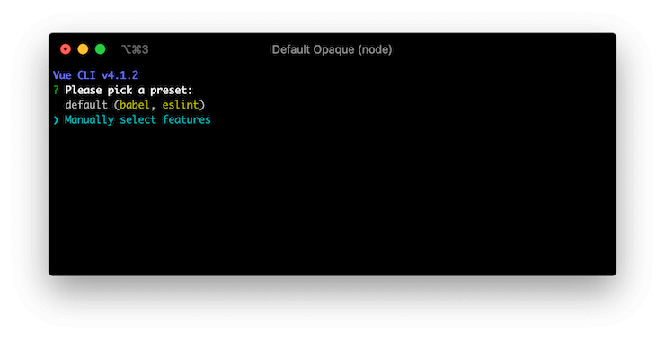
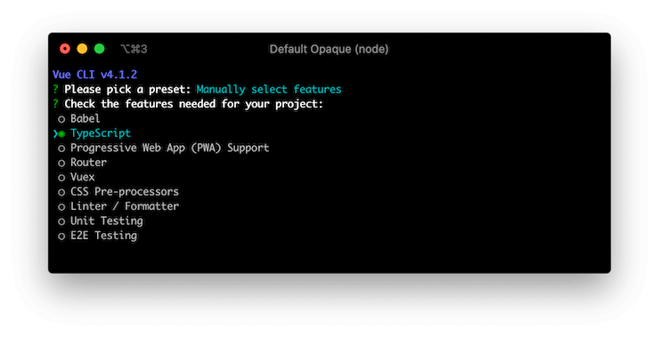

# 安装

## Vue CLI 设置

你可以使用[Vue CLI](https://cli.vuejs.org/)轻松设置 Vue Class Component 项目。运行以下命令以创建一个新项目：

```sh
$ vue create hello-world
```

系统将询问你是否使用预设。选择“手动选择功能”：



了解 TypeScrit 功能以使用 Vue Class Component。如果需要，还可以添加其他功能：



对于`Use class-style component syntax?`这个问题，按`y`键继续：


您可以根据自己的喜好回答其余问题。完成此设置过程后，Vue CLI 将创建一个新项目目录，其中安装了 Vue Class Component。

## 手动设置

如果你更喜欢手动设置，使用 npm 安装并配置你自己的构建工具。

### npm

你可以使用`npm`命令安装 Vue Class Component。请确保已经安装了 Vue 的核心库作为 Vue Class Component 的依赖。

```sh
$ npm install --save vue vue-class-component
```

也可以使用`yarn`命令：

```sh
$ yarn add --save vue vue-class-component
```

### 构建设置

要使用 Vue Class Component，您需要在项目中配置[TypeScript](https://www.typescriptlang.org/)或[Babel](https://babeljs.io/)，因为它在浏览器上运行依赖于[ECMAScript stage 1 装饰器](https://github.com/wycats/javascript-decorators/blob/master/README.md)

::: warning 警告
它不支持 stage 2 装饰器，因为 TypeScript Transpiler 仍然仅支持旧的装饰器规范。
:::

#### TypeScript

在你的项目根目录上创建`tsconfig.json`文件，并指定`experimentalDecorators`选项，以便其转译装饰器语法：

```json
{
  "compilerOptions": {
    "target": "es5",
    "module": "es2015",
    "moduleResolution": "node",
    "strict": true,
    "experimentalDecorators": true
  }
}
```

#### Babel

安装`@babel/plugin-proposal-decorators`和`@babel/plugin-proposal-class-properties`：

```sh
$ npm install --save-dev @babel/plugin-proposal-decorators @babel/plugin-proposal-class-properties
```

然后在项目根目录配置`.babelrc`：

```json
{
  "plugins": [
    ["@babel/proposal-decorators", { "legacy": true }],
    ["@babel/proposal-class-properties", { "loose": true }]
  ]
}
```

请注意，由于 Vue Class Component 仅支持 stage 1 装饰器规范，因此需要配置`legacy`和`loose`选项。

## CDN

[unpkg.com](https://unpkg.com/)提供基于 npm 的 CDN 链接，你可以通过替换 url 中的`@latest`部分选择指定版本的 Vue Class Component。(例如`https://unpkg.com/vue-class-component@7.2.2/dist/vue-class-component.js`使用 7.2.2 版本)。

```html
<!-- UMD build -->
<script src="https://unpkg.com/vue-class-component@latest/dist/vue-class-component.js"></script>

<!-- UMD minified build -->
<script src="https://unpkg.com/vue-class-component@latest/dist/vue-class-component.min.js"></script>

<!-- ES Module build -->
<script src="https://unpkg.com/vue-class-component@latest/dist/vue-class-component.esm.browser.js"></script>

<!-- ES Module minified build -->
<script src="https://unpkg.com/vue-class-component@latest/dist/vue-class-component.esm.browser.min.js"></script>
```

## 环境

Vue Class Component 是作为针对不同环境和用途的不同构建而提供的。

- **development 开发**
  - `vue-class-component.js` (UMD)
  - `vue-class-component.common.js` (CommonJS)
  - `vue-class-component.esm.js` (ES Module for bundlers)
  - `vue-class-component.esm.browser.js` (ES Module for browsers)
- **production (minified) 生产**
  - `vue-class-component.min.js` (UMD)
  - `vue-class-component.esm.browser.min.js` (ES Module for browsers)
